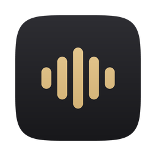

<p align="center">
  
</p>

<h1 align="center">Scribe</h1>

<p align="center"><b>Free, private, offline speech-to-text for your Mac.</b><br/>
Hold a key, speak, release. Your words appear wherever your cursor is.</p>

---

Scribe is a local dictation app. Everything runs on your machine: your voice never leaves your computer, there is no account, no subscription, and no cloud. It works in any app: email, chat, documents, code editors.

- **Dictate anywhere**: push-to-talk hotkey types the transcription straight at your cursor
- **Fully offline**: [Whisper](https://github.com/ggml-org/whisper.cpp) speech recognition accelerated on Apple Silicon GPUs
- **Multilingual**: including mixed-language speech (e.g. Hinglish), with automatic language detection
- **Personal dictionary**: teach it names and jargon it should always spell correctly
- **Optional AI cleanup**: a second hotkey that also removes filler words and fixes punctuation using a local LLM via [Ollama](https://ollama.com) (never the cloud)

## Install (Apple Silicon Macs, M1 and newer)

1. Download `Scribe-macos-arm64.zip` from the [latest release](../../releases/latest) and unzip it.
2. Drag `Scribe.app` into your **Applications** folder.
3. Open it: **right-click → Open → Open** (needed once; the app is unsigned, so macOS asks the first time).
4. Grant the two permissions it asks for:
   - **Microphone**: to hear you
   - **Accessibility**: to type the text into other apps
5. Pick a speech model when prompted (Whisper **Turbo** is a good default; it downloads once, ~1.5 GB).
6. Click into any text field, **hold Option+Space**, speak, release.

That's it. The hotkey, model, dictionary, and everything else can be changed later from the Scribe menu bar icon (the gold waveform).

### Optional: AI cleanup

If you want the second hotkey (Option+Shift+Space) to also polish your dictation (removing "um"s, fixing punctuation), install [Ollama](https://ollama.com), pull a small model, and point Scribe at it:

```
brew install ollama
brew services start ollama
ollama pull qwen2.5:3b-instruct-q4_K_M
```

Then in Scribe: Settings → Post-processing → provider `Custom` → URL `http://localhost:11434/v1` → model `qwen2.5:3b-instruct-q4_K_M`. This is entirely optional and entirely local too.

## Build from source

Requires [Rust](https://rustup.rs) and [Bun](https://bun.sh):

```
bun install
mkdir -p src-tauri/resources/models
curl -o src-tauri/resources/models/silero_vad_v4.onnx https://blob.handy.computer/silero_vad_v4.onnx
bun run tauri build -- --bundles app
```

Or fork this repo and run the **Scribe macOS build** workflow under Actions.

The app icon and menu bar icons are generated procedurally; see `scripts/make_icons.py`.

## Credits

Speech recognition by [whisper.cpp](https://github.com/ggml-org/whisper.cpp). Voice activity detection by [Silero VAD](https://github.com/snakers4/silero-vad). Built on open-source foundations; see [LICENSE](LICENSE) for attribution.

## License

[MIT](LICENSE).
